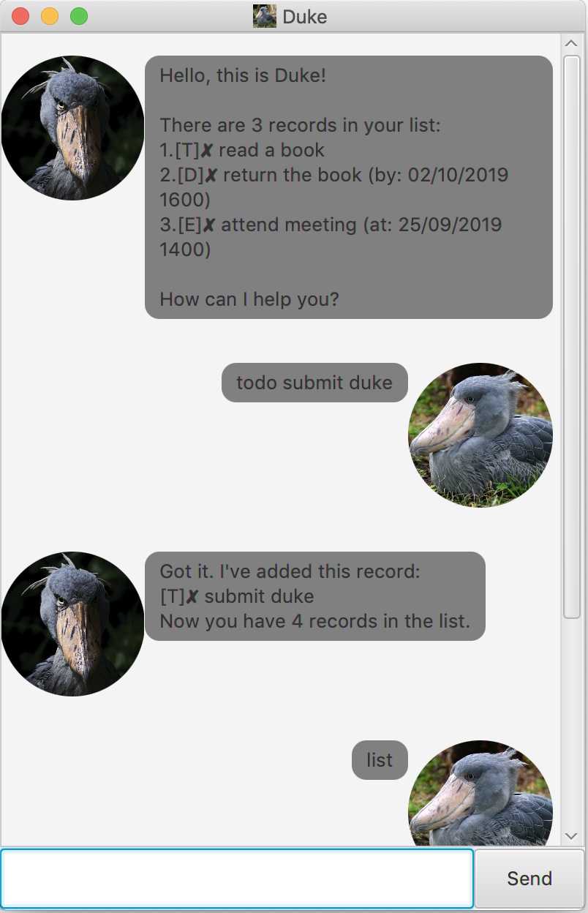
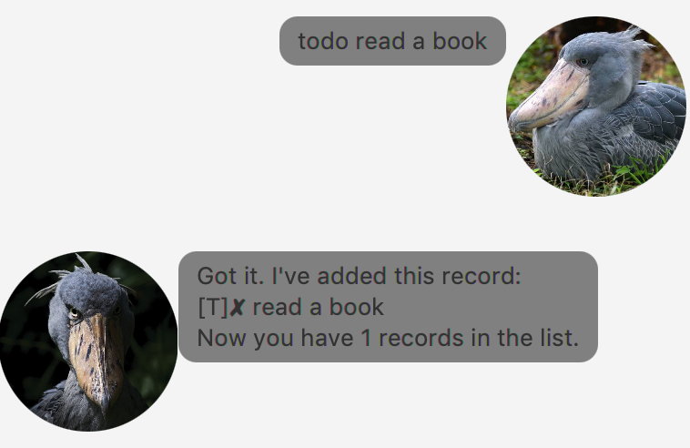
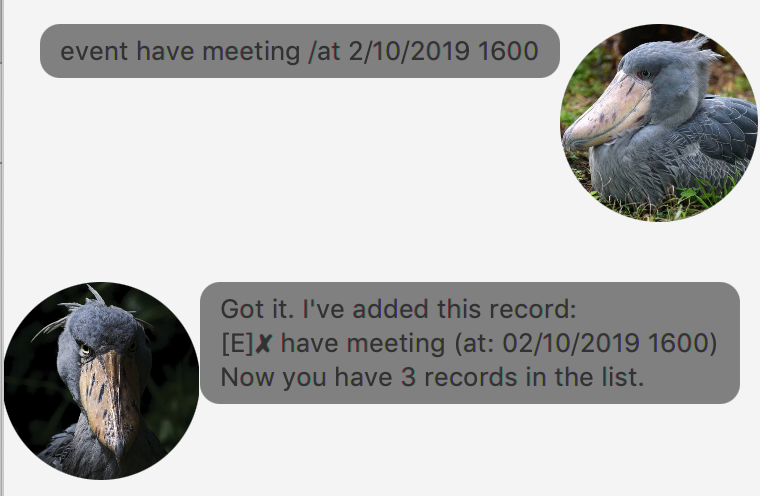
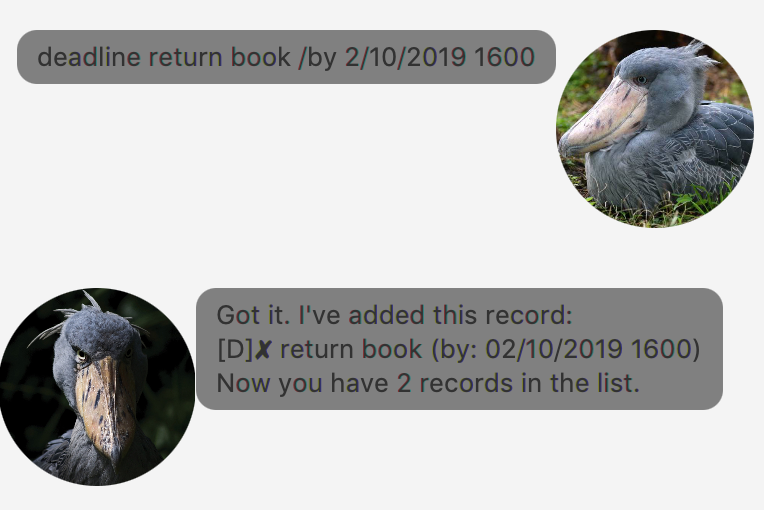
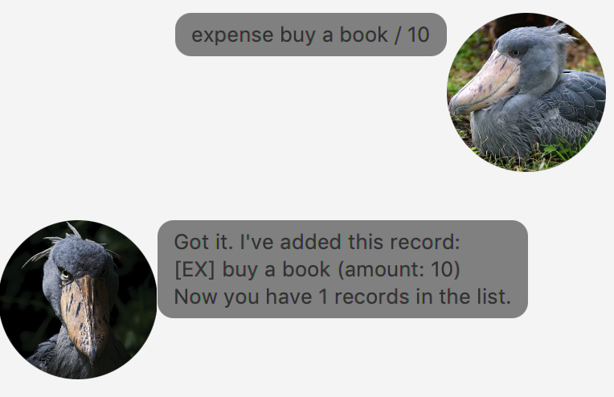
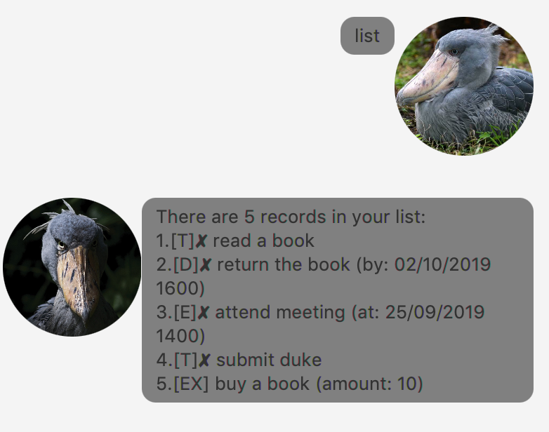
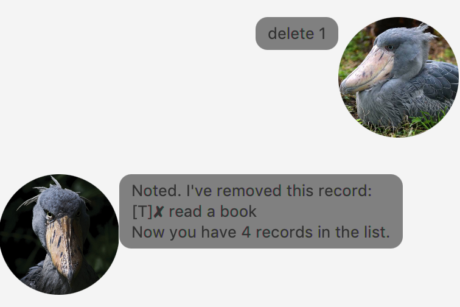
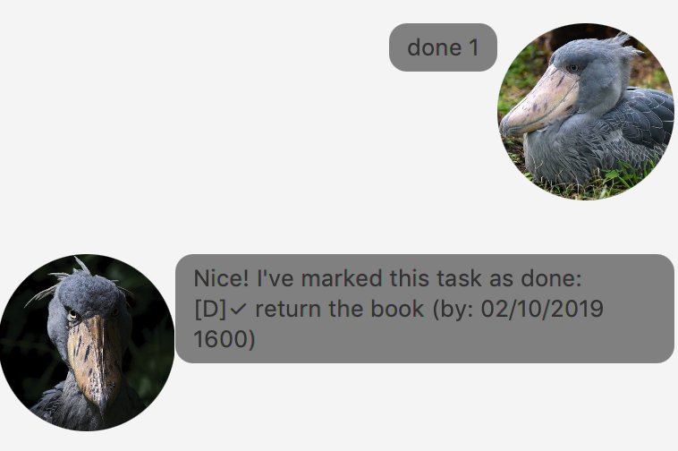
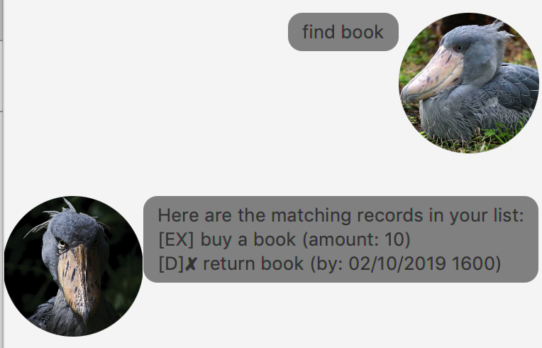
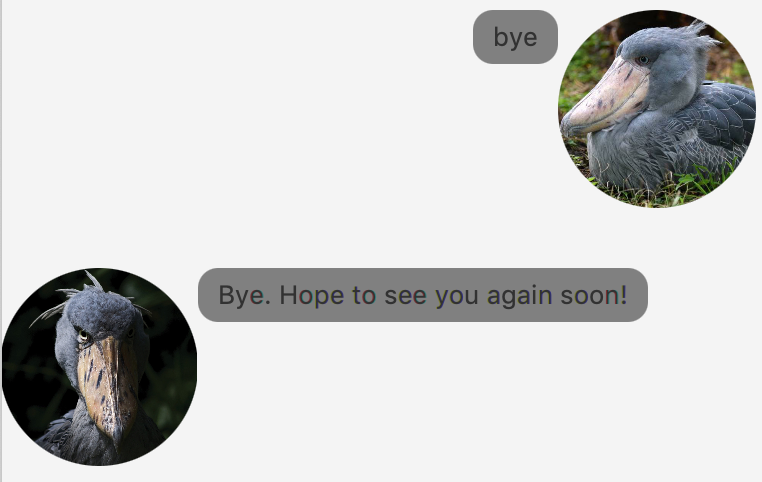

# User Guide

[1. Introduction](#1-introduction)

[2. Quick Start](#2-quick-start)

[3. Features](#3-features)

- [3.1. Add a record](#31-add-a-record) 
  
  - [3.1.1. Add a task](#311-add-a-task)
  
    - [3.1.1.1. Add a todo task: `todo`](#3111-add-a-todo-task-todo)
    
    - [3.1.1.2. Add an event task: `event`](#3112-add-an-event-task-event)
    
    - [3.1.1.3. Add a deadline task: `deadline`](#3113-add-a-deadline-task-deadline)
      
  - [3.1.2. Add an expense: `expense`](#312-add-an-expense-expense) 
  
- [3.2. List all records: `list`](#32-list-all-records-list) 
  
- [3.3. Delete a record: `delete`](#33-delete-a-record-delete) 

- [3.4. Mark a task as done: `done`](#34-mark-a-task-as-done-done) 

- [3.5. Find records by keyword: `find`](#35-find-records-by-keyword-find)

- [3.6. Exit: `bye`](#36-exit-bye) 

- [3.7. Save and load records](#37-save-and-load-records)

## 1. Introduction

Duke is a memo chat bot that you can use in your daily life. It is a Command Line tool that allow you to quickly manage all your record. 

## 2. Quick Start

1. Installed  `Java 11` or above on your local machine.

2. Download duke-v1.0.3.jar [here](https://github.com/waynefong0401/duke/releases/tag/A-Release).

3. Move the jar file to your destination folder.

4. Double-click the jar file to run Duke. 

    

5. Type the command and enter to execute it.

## 3. Features 

## 3.1. Add a record:

There are two kinds of record: Task and Expense.

### 3.1.1. Add a task

There are three kinds of task: todo, event and deadline.

#### 3.1.1.1. Add a todo task: `todo`

`todo <description>`

Add a `todo` task with `<description>` to the record list.

Example: 

  `todo read book` will add a todo task with adescription `"read a book"` into the record list
  
  

#### 3.1.1.2. Add an event task: `event`

`event <description> /at <time>`

Add an `event` task with `<description>` and `<time>` to the record list. Seperate the description and time using `" /at "`. The time format need to be `"dd/MM/yyyy HHmm"`

Example: 

  `event have meeting /at 02/10/2019 1600` will add an event task with adescription `"have meeting"` and a time `"2/10/2019 1600"` into the record list.
  
  
  
#### 3.1.1.3. Add a deadline task: `deadline`

`deadline <description> /by <time>`

Add a `deadline` task with `<description>` and `<time>` to the record list. Seperate the description and deadline using `" /by "`. The time format need to be `"dd/MM/yyyy HHmm"`

Example: 

  `deadline return book /by 02/10/2019 1600` will add a deadline task with a description `"return book"` and a deadline `"2/10/2019 1600"` into the record list
  
  
  
### 3.1.2. Add an expense: `expense`

`expense <description> / <amount>`

Add an expense to the record list. Seperate the `<description>` and `<amount>` using `" / "`. 

Example:

  `expense buy a book / 10` will add an expense with a description `"buy a book"` with an amount `"10"` into the record list
  
  
  
## 3.2. List all records: `list`

`list`

List all the records in the record list
  
Example:

   

## 3.3. Delete a record: `delete`

`delete <index>`

Delete a record with the corresponding `<index>` in the record list(order by added time). The `<index>` need to be within the bound of the record list. You might check the record index using `list`.

Example:

  `delete 1` will delete the first record in the record list.
  
  
  
## 3.4. Mark a task as done: `done`

`done <index>`

Mark a task with the corresponding `<index>` in the record list(order by added time) as `done`. The `<index>` need to be within the bound of the record list. You might check the record index using `list`.

Example:

  `done 1`
  
  

## 3.5. Find records by keyword: `find`

`find <keyword>`

Find the records with the description that contain `<keyword>`.
  
Example:

  

## 3.6. Exit: `bye`

`bye`

Exit the program. The textbox and sendbutton will be disabled, you will not be able to execute command then.

Example:

  

## 3.7. Save and load records

When you enter the Duke, it will automatically load the records in the `data/duke.txt`. Also, when you make any change to the record list, the local file will be updated.

